# Champions League


<table>
        <tr>
            <td>
                
            </td>
            <td>
   <b><h2> 📌 Descrição </h2></b>
<p>

A **Champions League** API é um backend em **Node.js**, **Express** e **TypeScript** para gerenciamento de informações da Champions League.  

Disponibiliza endpoints para:  
- **Jogadores** → cadastro, consulta, atualização e exclusão.  
- **Clubes** → listagem de clubes participantes.  

O projeto segue boas práticas de arquitetura em camadas, priorizando **modularidade, escalabilidade e manutenção**.
</p>
     </td>
        </tr>
    </table>


## 🏗️ Arquitetura do Projeto

Projeto em **Node.js** estruturado em **camadas**, com comunicação via **JSON** na **porta 3333** (ex.: Postman).



### 🔄 Fluxo de Requisição

- Cliente envia requisição HTTP (`GET`, `POST`, `PATCH`, `DELETE`) para `/api/`.
- Servidor aplica middlewares e encaminha para a rota correta.
- A rota chama o **controller** correspondente.
- Controller aciona o **service** do caso de uso.
- Service consulta ou altera os dados pelo **repository**.
- Repository lê/escreve no **JSON**.
- Service retorna os resultados ao controller.
- Controller responde ao cliente em **JSON**.

---

## 🛠️ Tecnologias Utilizadas

- **Node.js** → Ambiente de execução.
- **Express.js** → Framework para criação da API REST.
- **TypeScript** → Tipagem estática e melhor manutenção do código.
- **Tsup** → Empacotamento e build do projeto.
- **TSX** → Suporte a execução de TypeScript sem necessidade de transpilar manualmente.
- **CORS** → Middleware para controle de acessos externos.

---

## 📡 Endpoints da API

### 👤 Players

| Método | Rota              | Descrição                          |
|--------|-------------------|------------------------------------|
| `GET`  | `/players`        | Retorna todos os jogadores         |
| `POST` | `/players`        | Cria um novo jogador               |
| `GET`  | `/players/:id`    | Retorna um jogador específico      |
| `PATCH`| `/players/:id`    | Atualiza informações de um jogador |
| `DELETE`| `/players/:id`   | Remove um jogador                  |

**Exemplo de resposta `GET /players`:**
```json
[
  {
    "id": 1,
    "name": "Lionel Messi",
    "club": "Paris Saint-Germain",
    "nationality": "Argentina",
    "position": "Forward",
    "statistics": {
      "Overall": 93,
      "Pace": 85,
      "Shooting": 94,
      "Passing": 91,
      "Dribbling": 95,
      "Defending": 38,
      "Physical": 65
    }
  }
]
```
**Exemplo de resposta `GET /players/1`:**
```json
{
  "id": 1,
  "name": "Lionel Messi",
  "club": "Paris Saint-Germain",
  "nationality": "Argentina",
  "position": "Forward",
  "statistics": {
    "Overall": 93,
    "Pace": 85,
    "Shooting": 94,
    "Passing": 91,
    "Dribbling": 95,
    "Defending": 38,
    "Physical": 65
  }
}
```

**Exemplo de requisição `PATCH /players/1`:**
```json
{
    "Overall": 99,
    "Pace": 99,
    "Shooting": 99,
    "Passing": 99,
    "Dribbling": 99,
    "Defending": 99,
    "Physical": 99
}
```
**Exemplo de resposta:**
```json
{
  "id": 1,
  "name": "Lionel Messi",
  "club": "Inter Miami",
  "nationality": "Argentina",
  "position": "Forward",
  "statistics": {
    "Overall": 99,
    "Pace": 99,
    "Shooting": 99,
    "Passing": 99,
    "Dribbling": 99,
    "Defending": 99,
    "Physical": 99
  }
}
```

**Exemplo de resposta `DELETE /players/1`:**
```json
{
  "message": "deleted"
}
```

### 🏟️ Clubs

| Método | Rota              | Descrição                          |
|--------|-------------------|------------------------------------|
| `GET`  | `/clubs`          | Retorna todos os clubes            |


**Exemplo de resposta `GET /clubs`:**
```json
[
  {
    "id": 1,
    "name": "Real Madrid"
  },
  {
    "id": 2,
    "name": "Barcelona"
  }
]
```
---

## 🚀 Como Rodar o Projeto
1️⃣ Clonar o repositório
```bash
git https://github.com/Jezebel1990/node-champions-league.git
```

2️⃣ Instalar dependências
```bash
npm install
```

3️⃣ Rodar em ambiente de desenvolvimento
```bash
npm run start:dev
```

4️⃣ Rodar com hot reload (watch mode)
```bash
npm run start:watch
```

5️⃣ Gerar build e executar versão compilada
```bash
npm run start:dist
```

---
Feito com ♥ por [Jezebel Guedes](https://www.linkedin.com/in/jezebel-guedes/) 👋 Entre em contato!